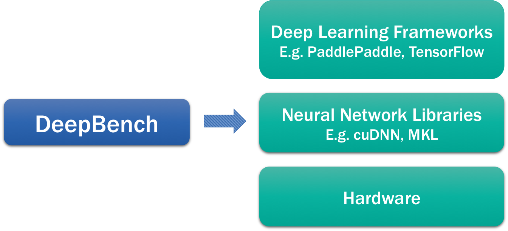

- [DeepBench](#deepbench)
- [Types of Operations](#types-of-operations)
- [Training Benchmark](#training-benchmark)
- [Inference Benchmark](#inference-benchmark)
- [Supported Ops & Precision](#supported-ops-and-precision)
- [Results](#results)
- [Get Involved](#get-involved)
- [Getting the Code](#getting-the-code)


# DeepBench

The primary purpose of DeepBench is to benchmark operations that are
important to deep learning on different hardware platforms. Although
the fundamental computations behind deep learning are well understood,
the way they are used in practice can be surprisingly diverse. For
example, a matrix multiplication may be compute-bound,
bandwidth-bound, or occupancy-bound, based on the size of the matrices
being multiplied and the kernel implementation. Because every deep
learning model uses these operations with different parameters, the
optimization space for hardware and software targeting deep learning
is large and underspecified.

DeepBench attempts to answer the question, "Which hardware provides
the best performance on the basic operations used for deep
neural networks?".  We specify these operations at a low level,
suitable for use in hardware simulators for groups building new
processors targeted at deep learning. DeepBench includes operations
and workloads that are important to both training and inference.

## Where does DeepBench fit in? 

The Deep Learning eco system consists of several different pieces. 
We wanted to highlight where DeepBench fits into this eco system. 
The diagram below describes the software and hardware components involved with deep learning.
At the very top, deep learning frameworks like Baidu's [PaddlePaddle](https://github.com/baidu/Paddle), Theano, 
TensorFlow, Torch etc. All these frameworks allow deep learning researchers to build models. They include basic building 
blocks like layers which can be connected in different ways to create a model. In order to train the deep learning models, 
the frameworks work with underlying neural network libraries such as NVIDIA's cuDNN and Intel's MKL. 
These libraries implement operations such as matrix multiply that are important to deep learning models. 
Finally, the models are trained on hardware like NVIDIA GPUs or Intel's Xeon Phi processor.



DeepBench uses the neural network libraries to benchmark the performance of basic operations on different hardware.
It does not work with deep learning frameworks or deep learning models built for applications. 
We cannot measure the time required to train an entire model using DeepBench.
The performance characteristics of models built for different applications are very different from each other. 
Therefore, we are benchmarking the underlying operations involved in a deep learning model. 
Benchmarking these operations will help raise awareness amongst hardware vendors and software developers 
about the bottlenecks in deep learning training and inference.

## Methodology

DeepBench consists of a set of basic operations (dense matrix
multiplies, convolutions and communication) as well as some recurrent
layer types.  There are Excel spreadsheets (`DeepBenchKernels_train.xlsx` & 
`DeepBenchKernels_inference.xlsx`) in this repository that describes all 
of the sizes for training and inference respectively.

For training, both forward and backward operations are tested. The precision
requirements for training and inference are discussed in the sections below.

We will use vendor supplied libraries even if faster independent
libraries exist or faster results have been published. Most users will
default to the vendor supplied libraries and as such the vendor
supplied libraries are most representative of users' experience.

## Entry

DeepBench includes training results for seven hardware platforms, NVIDIA's
TitanX, M40, TitanX Pascal, TitanXp, 1080 Ti, P100 and Intel's Knights
Landing. Inference results are included for three server platforms, NVIDIA's
TitanX Pascal, TitanXp and 1080 Ti. Inference results are also included 
for three mobile devices iPhone 6 &7, RaspBerry Pi 3. We provide an overview of the
results and all results are available in the `results` folder. We will
gladly accept pull requests for new hardware platforms.


# Types of Operations

## Dense Matrix Multiplies

Dense matrix multiplies exist in almost all deep neural networks
today.  They are used to implement fully connected layers and vanilla
RNNs and are building blocks for other types of recurrent layers.
Sometimes they are also used as a quick way to implement novel layer
types for which custom code doesn't exist.

When performing the GEMM operation `A * B = C`, either or both of `A`
and `B` can be optionally transposed. Common terminology to describe a matrix problem 
is the triple (M, N, K), which describes the sizes of the matrices involved, 
and the “op” which tells us which matrices (if any) are transposed. The figure below
describes how the triple (M, N, K) correspond to the sizes of the matrices being multiplied.


The variant where both matrices
are transposed is not used in neural networks.  The other three
variants *are* used, but they need not be implemented as a call to
`SGEMM` with those transpose descriptors.  Sometimes it can be faster
to perform an in-place transpose followed by the appropriate
multiplication and a transpose back.  Such optimizations should be
detailed in the spreadsheet.

The constant coefficients alpha and beta should both be 1.0 so that no
work is elided.

## Convolutions

Convolutions make up the vast majority of flops in networks that
operate on images and videos and form important parts of networks such
as speech and natural language modeling, thus making them perhaps the
single most important layer from a performance perspective.

Convolutions have 4 or 5 dimensional inputs and outputs giving rise to
a large number of possible orderings for these dimensions.  For the
first version of the benchmark we are only concerned with performance
in NCHW format i.e.  data is presented in image, feature maps, rows
and columns.

There are many techniques for computing convolutions that are optimal
for different sizes of the filter and image, including:  direct, matrix multiply
based, FFT based, and Winograd based approaches.  In the first version
of this benchmark, we are not concerned about the accuracy of the
different approaches since the general consensus is that 32-bit
floating point is accurate *enough* for each of them. We have noted
the approach used for each size in the spreadsheet.

## Recurrent Layers

Recurrent layers are usually made up of some combination of the above
operations and also simpler operations such as unary or binary
operations which aren't very compute intensive and generally constitute a
small percentage of overall runtime.  However, the GEMM and
convolution operations are relatively small in recurrent layers, 
so the cost of these smaller operations can become significant.  This is especially true if there
is a high fixed overhead associated with starting a computation.  It
is also possible to use alternate storage formats for the recurrent
matrices because the cost of converting to a new storage format can be
amortized over the many steps of the recurrent computation.  If this
is done, the time to convert to and from the custom format should be
included in the overall time.

These factors lead to many optimization possibilities both within a
time step and across a sequence of time steps such that measuring the
raw performance of the operations is not necessarily
representative of the performance of an entire recurrent layer.  In
this benchmark we focus on only one recurrent layer, even though there
are even more optimization opportunities if one considers stacks of
them.

The calculation of the inputs should not be included in the time for
the recurrent layer calculation since it can be calculated as one
large multiply and then consumed by the actual recurrent calculation.
So in: h_t = g(Wx_t + Uh_t-1) the time for the calculation of Wx_t for
all t should not be included in the time for the recurrent layer.

The backward calculation should calculate the updates with respect to
the weights but not the inputs.  All the recurrent work is done to
calculate the weight updates, so calculating the updates with respect
to the inputs as well just obscures what we are trying to measure.

DeepBench includes support for three types of recurrent cells; 
vanilla RNNs, LSTMs and GRUs. The non-linearity for vanilla RNNs 
should be a ReLU.  The internal non-linearities of the LSTM should
be the standard operations - sigmoid for the gates and tanh for 
the activations.  The LSTM should not have peephole connections.
The internal of the GRU should be a sigmoid for reset and update
gates. The output gate non linearity should be a ReLU.


## All-Reduce

Neural networks today are often trained across multiple GPUs or even
multiple systems, each with multiple GPUs.  There are two main categories of techniques for
doing this: synchronous and asynchronous. Synchronous techniques rely
on keeping the parameters on all instances of the model synchronized, usually by making
sure all instances of the model have the same copy of the gradients before taking an
optimization step.  The
[Message Passing Interface (MPI)](https://en.wikipedia.org/wiki/Message_Passing_Interface)
primitive usually used to perform this
operation is called All-Reduce. There are many ways to implement
All-Reduce based on the number of ranks, the size of the data, and the
topology of the network.  This benchmark places no constraints on the
implementation other than that it should be
deterministic. Asynchronous methods are quite varied and in this
version of the benchmark we will not be attempting to test these
methods.

In order to evaluate All-Reduce, we use the following libraries and benchmarks:
* [NVIDIA's NCCL](https://developer.nvidia.com/nccl)
* [Ohio State University (OSU) Benchmarks](http://mvapich.cse.ohio-state.edu/benchmarks/)
* [Baidu's Allreduce](https://github.com/baidu-research/baidu-allreduce/)
* [Intel's MLSL](https://github.com/intel/MLSL)

The NCCL library can be build without MPI (for single node) and with MPI (for multinode) as shown in https://github.com/NVIDIA/nccl-tests. 
We therefore have two versions of NCCL for the single node in the experiments. For  multinode experiments,
we use only NCCL with MPI, the benchmark from OSU, and Baidu's Allreduce implementation. 
We report the shortest latency achieved from all implementations for each configuration.

Intel(R) Machine Learning Scaling Library (Intel(R) MLSL) is a library
providing an efficient implementation of communication patterns used in deep learning.
In order to evaluate All-Reduce performance, we use All-Reduce benchmark from OSU.

#### Topology for NVIDIA 8 GPU System
Each node has two CPU sockets (dual root topology), and each socket has a PCIe root complex.  For each socket there are two PLX switches that are each connected to the CPU socket via 16 lanes of PCIe v3.  There are two GPUs on each PLX switch. All pairs of GPUs communicate simultaneously over 16 lanes of PCIe v3. The two CPU sockets are connected via Intel QPI. The interconnect across nodes is InfiniBand FDR. The figure below shows a schematic diagram of one our nodes, where all devices connected by the same PCI
root complex are encapsulated in a dotted box. In our experiments, P100, TitanX Maxwell and M40 were such systems.


#### Topology for NVIDIA 10 GPU System
Each node has one CPU socket (single root topology) with two PLX switches, each switch are connected to 5 GPUs. The communication among the GPUs in the same PLX switch traverses through the PLX switch only, whereas 
the communication to any GPU connected to the other PLX switch requires traversal both PLX switches along with the connecting PCIe bridge. In our experiments, TitanX Pascal, and 1080Ti were such systems.

#### Topology for Intel Xeon Phi and Omni-Path System
The blocking All-Reduce latency is measured on Intel Xeon Phi processor 7250 on Intel’s internal Endeavor cluster
with Intel® Omni-Path Architecture (Intel® OPA) series 100 fabric with fat-tree topology, using Intel MPI 2017 Update 3 and Intel MLSL 2017 Update 2 Preview.

# Training Benchmark

The training benchmark includes support for all the operations discussed
above. The `DeepBenchKernels_train.xlsx` file contains the entire list of
kernels for the training benchmark.

## Training Precision


While training deep learning models, most researchers typically use 
single precision floating point numbers for all compute kernels. 
Academic research has demonstrated that reduced precision training works 
for several different models trained on limited datasets. In our experience, 
we’ve found that 16 bit half precision floating point numbers are 
sufficient to train large deep learning models on large datasets reliably. 
Training with half precision numbers allows hardware vendors to better 
utilize the available computing power. In addition, the parameters require 
half the total storage for the entire model.


DeepBench specifies the minimum precision requirements for training. We are specifying 
precision for multiply and add for all the operations. **The minimum precision 
for multiplication and addition is set to 16 and 32 bits respectively.** 
None of the currently available hardware supports 16 bit multiply and 32 bit accumulate. 
We will accept results on any hardware platform that satisfies this minimum precision 
requirement. All results will include the precision that is used for the benchmark.

# Inference Benchmark

Benchmarking inference is a very challenging problem. There are many applications 
that have been enabled by deep learning and each of them have their unique 
performance characteristics and requirements. We selected applications for benchmarking
that receive high user traffic. We are also including kernels from deep learning models
that are used across several different applications.

For the inference kernels, we cover the same set of operations as the training set i.e. 
matrix multiply, convolution and recurrent operations. The kernels have some differences 
from the training counterparts. In the next few sections, we discuss the changes needed 
to benchmark inference workloads. The `DeepBenchKernels_inference.xlsx` file contains
the complete list of kernels for the training benchmark.


## Deployment Platform

Large scale real world applications such as image search, language translation and 
speech recognition are typically deployed on servers located in data centers. The client 
sends the request over the internet which is processed on the remote server hosting the 
deep learning model. The remote server is typically a powerful machine consisting of many 
processors. The memory and compute capabilities are large enough to host very large deep 
learning models. The downside of deploying the model on the server is the latency depends 
on the network bandwidth between the client and the server. It also requires the user to 
be connected to the internet. In order to address these issues, several models are being 
deployed on end devices.  On-device deployment enables deep learning models to have lower 
latency and are always available regardless of internet connectivity. However, these models 
need to be smaller in order to fit within the power and memory constraints of mobile and 
embedded devices.

In DeepBench, we measure the performance of inference kernels on both server and mobile 
platforms. Hardware vendors or users can 
run the appropriate benchmarks and add their results to the repository. We provide an overview 
of the results below and detailed results are available in the `results/inference` folder. 
We will gladly accept pull requests for new hardware platforms.

## Inference Batch Size

In order to meet latency requirements of user requests, most internet applications process 
requests individually as they arrive at the data center. This makes for a straightforward 
application where each request is handled by a single thread. However, this is inefficient 
for two reasons. Processing requests individually makes the operation bandwidth bound as 
the processor needs to load weights of the network. This makes it harder for processor to 
effectively utilize the on chip caches. Secondly, the amount of parallelism that can be 
exploited to classify one request is limited, making it difficult to exploit SIMD or multicore 
parallelism. RNNs are especially challenging to deploy because evaluating RNNs sample by sample 
relies on matrix vector multiplication, which are bandwidth bound and difficult to parallelize.

To overcome these issues, we built a batching scheduler called Batch Dispatch which assembles 
streams of data from user requests into batches before performing forward propagation on these 
batches. In this case, there is a tradeoff between increased batch size, and consequently 
improved efficiency, and increased latency. The more we buffer user requests to assemble a large batch, 
the longer users must wait for their results. This places constraints on the amount of batching we can perform.

In practice, we’ve seen that batching requests up to 4 or 5 seems to work well for efficiency and 
latency for data center deployment. In the case of deployment on devices, the batch size is limited to 1.

## Inference Precision

Deep Neural networks are trained using single precision or half precision floating point numbers. 
The precision requirements for inference are significantly lower than training. Several different 
models can deployed with 8 bit representations for inference with little or no loss in accuracy 
compared to their floating point models. **Therefore, for inference kernels, we’re specifying the 
minimum precision for multiplication and accumulation of 8 and 32 bits respectively.** Since 
all hardware platforms may not support this precision requirement, we will accept results for any 
platform that satisfies this minimum requirement. All results will include the precision used for the benchmark.

To benchmark matrix multiplication with 8 bit inputs for ARM processors, 
we use the Gemmlowp library. Convolution kernels from the ARM Compute Library are used for convolution benchmark. 
The ARM Compute library only supports single precision convolutions. Low precision convolution 
support should be available shortly. The ARM Compute library doesn’t have any support for RNNs. 
Therefore, DeepBench does not include RNN results for ARM devices. We welcome contributions from other 
libraries that support RNN operations for ARM devices.

For server deployment, we use the cudNN library and cuBLAS library for Nvidia GPUs. For Nvidia GPUs, 
RNN kerenels only support single precision and results are reported with the same. More details regarding 
which ops are supported on different processors can be found in later sections.

## Sparse Operations

A sparse neural network is one where most of the weights of the neural network are zero. 
These zero weights don’t contribute in determining the prediction of the neural network. Sparse neural 
networks reduce memory and computation footprint which enables deep learning models to be deployed on 
mobile devices. Inference performance of RNNs is dominated by the memory bandwidth of the hardware, 
since most of the work is simply reading in the parameters at every time step. Moving from a dense 
calculation to a sparse one comes with a penalty, but if the sparsity factor is large enough, then 
the smaller amount of data required by the sparse routines becomes a win.


The more powerful server class processors used in data centers can generally perform inference quickly 
enough to serve one user, but in the data center performance per dollar is very important. Techniques 
such as sparsity that allow models to be evaluated faster enable more users to be served per GPU 
increasing the effective performance per dollar.

There has been a lot of progress in developing sparse neural networks in the past couple of years. DeepBench 
includes sparse matrix vector and sparse matrix multiply kernels. Based on our research, we’ve learnt 
that neural networks with 90 to 95% sparsity can achieve relatively good performance compared to their 
dense baselines. However, current implementations of sparse matrix multiply are optimized for much higher 
sparsity (around 99% or higher). By including sparse kernels, we’re hoping to incentivize hardware vendors 
and software developers to build libraries that provide good performance for sparsity in the range of 90~95%.

We use the Eigen library to benchmark sparse operations on ARM devices. For GPU benchmarks, we use the cuSparse 
library from Nvidia.

## Measuring Latency

Many inference applications have real time latency requirements. For example, speech interfaces 
require speech recognition models to return a result without a delay that is noticeable to a user. 
DeepBench kernels can be used as a starting point to measure the best case latency of individual 
operations. However, measuring full system latency is outside the scope of this release of DeepBench, 
given the focus on basic operations rather than complete applications. For example, a complete 
application running on a mobile device might need to modify the power state of the system when 
starting up. In another example, a complete server application might have a significant latency 
component that is determined by a user’s network connection to the server. We may consider 
addressing operation latency in a future version of DeepBench.

# Supported Ops and Precision
In this section, we document the support for the various operations across precisions for different processors.
As far as possible, we pick the precision that closely matches the minimum required precision. The precision 
requirements are stated below again. However, there are cases where we need to benchmark higher precision operations. 
The tables below highlight which operations are benchmarked for each processor.

**Minimum Precision for training**: 16 bit multiply, 32 bit accumulate

**Minimum Precision for inference**: 8 bit multiply, 32 bit accumulate

## Training

Single precision results are available for 5 Nvidia GPUs and Intel's Xeon Phi processor. None of the available
processors support 16 bit multiplication and 32 bit addition. Instead, we benchmark Nvidia's Psuedo FP16 mode
where inputs/outputs are 16 bit but the compute is still in single precision. Support for mixed precision training
is available in upcoming hardware processors.

| Processor               | Single precision   | FP16 inputs/FP32 math   | FP16 inputs / Mixed Precision Math |
| ----------------------- | ------------------ | ----------------------- | ---------------------------------- |
| Nvidia TitanX Maxwell   | GEMM, Conv, RNN    |                         |                                    |
| Nvidia Tesla M40        | GEMM, Conv, RNN    |                         |                                    |
| Nvidia 1080Ti           | GEMM, Conv, RNN    |                         |                                    |
| Nvidia TitanX Pascal    | GEMM, Conv, RNN    |                         |                                    |
| Nvidia TitanXp          | GEMM, Conv, RNN    |                         |                                    |
| Nvidia Tesla P100       | GEMM, Conv, RNN    | GEMM, Conv, RNN         |                                    |
| Nvidia Tesla V100       | GEMM, Conv, RNN    |                         | GEMM, Conv, RNN                    |
| Intel Xeon Phi 7250     | GEMM, Conv         |                         |                                    |


## Server Deployment

The GEMM and convolution benchmark are run with 8 bit multiplication and 32 bit accumulate on 
NVIDIA processors. However, NVIDIA GPUs don't support all input sizes for this precision mode.
Input sizes have to be a multiple of 4 to run in this precision mode. We have padded inputs dimensions 
to be multiples of 4 for all kernels. The cost of padding and discarding extra outputs is small
compared to the cost of the operation. The results spreadsheet indicates which of the kernels required
padding. Sparse operations and Recurrent kernel results are reported in single precision since 
the relevant libraries don't support low precision.

| Processor                  | Single Precision             | Int8 multiply/32 bit accumulate | 
|-----------------------|------------------|-----------------------|
| Nvidia 1080Ti              | RNN, Sparse GEMM | GEMM, Conv                                 |
| Nvidia TitanX Pascal       | RNN, Sparse GEMM | GEMM, Conv                                 |
| Nvidia TitanXp             | RNN, Sparse GEMM | GEMM, Conv                                 |

## Device Deployment

The table below describes the inference device kernel results available on different processors, ops and 
precision. We don't have any results for RNNs since no ARM libraries support RNNs. ARM Compute library
is not yet supported on the iPhone.

| Processor                  | Single Precision             | Int8 inputs/32 bit math | 
|-----------------------|------------------|-----------------------|
| Raspberry Pi 3        | Conv                         | GEMM, Sparse GEMM               |
| iPhone 6                   |                              | GEMM, Sparse GEMM               |
| iPhone 7                   |                              | GEMM, Sparse GEMM               |


# Results
In this section, we are documenting the performance for a few operations. 
These are picked at random and are only meant to demonstrate the performance for a few applications.
__The results below only include the time and TeraFLOPS for the fastest processor for the particular operation and parameters. The full results can be found in the `results` folder__. 

The precision used for benchmarking the training and inference processors is listed at the top of the results file. 

Training results can be found in the `results/training` folder which contains the following files:

* `DeepBench_IA_KNL7250.xlsx`: Training results on Intel's Xeon Phi Processor
* `DeepBench_NV_TitanX.xlsx`: Training results on NVIDIA's TitanX GPUs
* `DeepBench_NV_M40.xlsx`: Training results on NVIDIA's M40 GPUs
* `DeepBench_NV_TitanX_Pascal.xlsx`: Training results on NVIDIA's TitanX Pascal GPU
* `DeepBench_NV_TitanXp.xlsx`: Training results on NVIDIA's TitanXp Pascal GPU
* `DeepBench_NV_1080Ti.xlxs`: Training results on NVIDIA's 1080 Ti GPU
* `DeepBench_NV_P100.xlsx`: Training results on NVIDIA's P100 GPU
* `DeepBench_NV_V100.xlsx`: Training results on NVIDIA's V100 GPU

Detailed inference results can be found in the `results/inference` folder which contains the following files:
* `server/DeepBench_NV_TitanXp.xlsx`: Inference results on NVIDIA's TitanXp GPUs
* `server/DeepBench_NV_TitanXp.xlsx`: Inference results on NVIDIA's TitanXp Pascal GPU
* `server/DeepBench_NV_1080Ti.xlxs`: Inference results on NVIDIA's 1080 Ti GPU
* `device/DeepBench_iPhone_7.xlsx` : Inference results on iPhone 7
* `device/DeepBench_iPhone_6.xlsx` : Inference results on iPhone 6
* `device/DeepBench_Raspberry_Pi_3.xlsx` : Inference results on Raspberry Pi 3

The software libraries (e.g. cuDNN, OpenMPI) used to benchmark performance are mentioned in each of Excel workbooks in `Specs` sheet.
Please feel free to ask us any clarifying questions.

Results on more hardware platforms will be added once they are available. We welcome contributions from all hardware vendors.

## Training Results

### GEMM Results

| Kernel                 | A Transpose | B Transpose | Application        | Time (ms) | TeraFLOPS | Processor     |
|------------------------|-------------|-------------|--------------------|--------------|-----------|---------------|
| M=1760, N=128, K=1760  | N           | N           | Speech Recognition | 0.07         | 10.72      | Tesla V100 Mixed Precision |
| M=7860, N=64, K=2560   | N           | N           | Speech Recognition | 0.10         | 25.94      | Tesla V100 Mixed Precision |
| M=2560, N=64, K=2560   | N           | N           | Speech Recognition | 0.08         | 10.11      | Tesla V100 Mixed Precision |
| M=5124, N=9124, K=2560 | T           | N           | Speech Recognition | 8.73         | 27.43      | Tesla V100 Mixed Precision |
| M=3072, N=128, K=1024  | T           | N           | Speech Recognition | 0.04         | 18.73      | Tesla V100 Mixed Precision |

### Convolution Results

| Input Size                        | Filter Size     | # of Filters   | Padding (h, w)   | Stride (h, w)   | Application          | Total Time (ms)   | Fwd TeraFLOPS   | Processor       |
| --------------------------------- | --------------- | -------------- | ---------------- | --------------- | -------------------- | ----------------- | --------------- | --------------- |
| W = 700, H = 161, C = 1, N = 32   | R = 5, S = 20   | 32             | 0, 0             | 2, 2            | Speech Recognition   | 1.53              | 7.75            | Tesla V100 FP32 |
| W = 54, H = 54, C = 64, N = 8     | R = 3, S = 3    | 64             | 1, 1             | 1, 1            | Face Recognition     | 0.55              | 10.12           | Tesla V100 FP32 |
| W = 224, H = 224, C = 3, N = 16   | R = 3, S = 3    | 64             | 1, 1             | 1, 1            | Computer Vision      | 2.40              | 1.40            | Tesla V100 FP32 |
| W = 7, H = 7,  C = 512, N = 16    | R = 3, S = 3    | 512            | 1, 1             | 1, 1            | Computer Vision      | 0.70              | 14.56           | Tesla V100 Mixed Precision |
| W = 28, H = 28, C = 192, N = 16   | R = 5, S = 5    | 32             | 2, 2             | 1, 1            | Computer Vision      | 0.93              | 16.90           | Tesla V100 FP32  |

### Recurrent Ops Results

The recurrent op kernels are only run on NVIDIA hardware.

| Hidden Units   | Batch Size   | TimeSteps   | Recurrent Type   | Application           | Total Time (ms) | Fwd TeraFLOPS   | Processor       |
| -------------- | ------------ | ----------- | ---------------- | --------------------- | ------------    | --------------- | --------------- |
| 1760           | 16           | 50          | Vanilla          | Speech Recognition    | 8.21            | 1.19            | Tesla V100 Mixed Precision |
| 2560           | 32           | 50          | Vanilla          | Speech Recognition    | 10.50           | 4.08            | Tesla V100 Mixed Precision |
| 1024           | 128          | 25          | LSTM             | Machine Translation   | 5.56            | 10.91           | Tesla V100 Mixed Precision |
| 2816           | 32           | 1500        | GRU              | Speech Recognition    | 380.04          | 11.85           | Tesla V100 Mixed Precision |

### All-Reduce Results

| Size (# of floats) | Number of Processors | Application        | Time (ms)   | Bandwidth (GB/s) | Processor                           |
|--------------------|----------------------|--------------------|-------------|------------------|-------------------------------------|
| 16777216           | 8                    | Speech Recognition | 8.66        | 61.99            | Xeon Phi 7250 with Intel® Omni-Path |
| 16777216           | 16                   | Speech Recognition | 14.72       | 72.94            | Xeon Phi 7250 with Intel® Omni-Path |
| 16777216           | 32                   | Speech Recognition | 19          | 113.03           | Xeon Phi 7250 with Intel® Omni-Path |
| 64500000           | 32                   | Speech Recognition | 76.68       | 107.67           | Xeon Phi 7250 with Intel® Omni-Path |

## Inference Server Results

The next few sections provide a few results for GEMM, Convolution and Recurrent operations for inference kernels on
server platforms. Results on Intel platforms should be available shortly.

### GEMM Results

| Kernel                 | Application        | Results (ms) | TeraFLOPS | Processor |
|------------------------|--------------------|--------------|-----------|-----------|
| M=5124, N=700, K=2048  | Speech Recognition | 0.46         | 31.94     | 1080 Ti   |
| M=35, N=700, K=2048    | Speech Recognition | 0.05         | 2.09      | 1080 Ti   |
| M=3072, N=3000, K=1024 | Speech Recognition | 0.49         | 38.36     | Titan Xp  |
| M=512, N=6000, K=2816  | Speech Recognition | 0.43         | 40.71     | Titan Xp  |

### Sparse GEMM Results

| Kernel                 | Sparsity | Application        | Results (ms) | Speedup wrt dense | TeraFLOPS | Processor |
|------------------------|----------|--------------------|--------------|-------------------|-----------|-----------|
| M=7680, N=1, K=2560    | 0.95     |Speech Recognition  | 0.03         | 6.56              | 1.10      | 1080 Ti   |
| M=7680, N=2, K=2560    | 0.95     |Speech Recognition  | 0.04         | 5.93              | 1.74      | 1080 Ti   |
| M=7680, N=1500, K=2560 | 0.95     |Speech Recognition  | 29.81        | 0.16              | 1.88      | TitanXp   |
| M=10752, N=1, K=3584   | 0.9      | Speech Recognition | 0.1          | 4                 | 0.72      | TitanXp   |

### Convolution Results

| Input Size                     | Filter Size   | # of Filters | Padding (h, w) | Stride (h, w) | Application        | Time (ms) | TeraFLOPS | Processor     |
|--------------------------------|---------------|--------------|----------------|---------------|--------------------|-----------|-----------|---------------|
| W = 341, H = 79, C = 32, N = 4 | R = 5, S = 10 | 32           | 0,0            | 2,2           | Speech Recognition | 0.29      | 9.03      | TitanXp       |
| W = 224, H = 224, C = 3, N = 1 | R = 7, S = 7  | 64           | 3, 3           | 2, 2          | Computer Vision    | 0.14      | 1.64      | TitanXp       |
| W = 56, H = 56, C = 256, N = 1 | R = 1, S = 1  | 128          | 0, 0           | 2, 2          | Computer Vision    | 0.015     | 3.43      | TitanX Pascal |
| W = 7, H = 7,  C = 512, N = 2  | R = 1, S = 1  | 2048         | 0, 0           | 1, 1          | Computer Vision    | 0.018     | 11.42     | 1080 Ti       |

### RNN Results

| Hidden Units | Batch Size | TimeSteps | Recurrent Type | Application                  | Results (ms) | Fwd TeraFLOPS | Processor |
|--------------|------------|-----------|----------------|------------------------------|------------|---------------|-----------|
| 1536         | 4          | 50        | LSTM           | Language Modelling           |   6.93      |  0.55             |  TitanXp         |
| 256          | 4          | 150       | LSTM           | Character Language Modelling |   1.63         |  0.19             |   1080 Ti        |
| 2816         | 1          | 1500      | GRU            | Speech Recognition           |   350.62         |  0.20             | TitanXp          |
| 2560    |   2         |   375        |  GRU              | Speech Recognition       |  75.02          |     0.39 | TitanXp          |

## Inference Device Results

### GEMM Results

| Kernel                 |  Application        | Results (ms) | GigaFLOPS | Processor     |
|------------------------|--------------------|--------------|-----------|---------------|
| M=5124, N=700, K=2048  | Speech Recognition | 212.84         | 69.03      | iPhone 7 |
| M=35, N=700, K=2048   | Speech Recognition | 1.94         | 51.69      | iPhone 7 |
| M=3072, N=1500, K=1024 | Speech Recognition | 136.63         | 69.07      | iPhone 7 |

### Sparse GEMM Results

| Kernel                 | Sparsity | Application        | Results (ms) | Speedup wrt dense | GigaFLOPS | Processor |
|------------------------|----------|--------------------|--------------|-------------------|-----------|-----------|
| M=7680, N=1, K=2560    | 0.95     |Speech Recognition  | 1.01         | 15.55             | 18.55     | iPhone 7  |
| M=7680, N=1500, K=2560 | 0.95     |Speech Recognition  | 1677.36      | 5.46              | 16.70     | iPhone 7  |
| M=7680, N=1, K=2560    | 0.9      | Speech Recognition | 2.1          | 8.02              | 8.41      | iPhone 7  |


### Convolution Results

| Input Size                      | Filter Size  | # of Filters | Padding (h, w) | Stride (h, w) | Application     | Time (ms) | GigaFLOPS | Processor      |
|---------------------------------|--------------|--------------|----------------|---------------|-----------------|-----------|-----------|----------------|
| W = 112, H = 112, C = 64, N = 1 | R = 1, S = 1 | 64           | 0, 0           | 1, 1          | Computer Vision | 670.75    | 0.15      | Raspberry Pi 3 |
| W = 56, H = 56, C = 256, N = 1  | R = 1, S = 1 | 128          | 0, 0           | 2, 2          | Computer Vision | 185.87    | 0.28      | Raspberry Pi 3 |
| W = 7, H = 7,  C = 512, N = 1   | R = 1, S = 1 | 2048         | 0, 0           | 1, 1          | Computer Vision | 735.28    | 0.14      | Raspberry Pi 3 |

# Get Involved

We welcome contributions from the community to DeepBench. You can contribute in two ways:

1. Deep Learning Researchers/Engineers: If you are deep learning researcher or engineer working on a new deep learning application, you may have different operations and/or workloads involved in training your model. We are interested in learning more about the underlying operations that are adversely impacting the performance (speed) of your model. Please contribute these operations and workloads!
2. Hardware Vendors: We would gladly accept contributions from other hardware vendors. We're open to accepting benchmark results from large companies or smaller startups building hardware for training deep learning models. Please contribute benchmark results for your hardware!

# Getting the Code
To get the code, simply clone the github repo

```
git clone https://github.com/baidu-research/DeepBench
```

# NVIDIA Benchmarks
## Compiling

In order to build the benchmarks, you will need to specify the following paths:
```
MPI_PATH: Path to MPI library. The benchmarks have been tested with OpenMPI version 1.10.2.
CUDA_PATH: Path to CUDA library. The benchmarks have been tested with version 7.5.18.
CUDNN_PATH: Path to CUDNN library. The benchmarks have been tested with version 5.0.
NCCL_PATH: Path to NCCL library. NCCL library is available at https://github.com/NVIDIA/nccl. The benchmarks have been tested with commit b3a9e1333d9e2e1b8553b5843ba1ba4f7c79739d
```

To build all the benchmarks, please use the following command:
```
cd code/
make CUDA_PATH=<cuda_path> CUDNN_PATH=<cudnn_path> MPI_PATH=<mpi_path> NCCL_PATH=<nccl_path>
```

For distributions that split their MPI headers and libraries (e.g. RHEL, Fedora, CentOS) into separate directories you should also specify the path to the include files:

```
MPI_INCLUDE_PATH=<mpi_include_path>
```

You need to build the code for the appropriate architecture. By default, the architecture version is set to 5.2. This works for the TitanX and Tesla M40 GPU. In order build the benchmark for another architecture (such as Pascal with version 6.1), please append the following variable to the `make` command:

```
ARCH=sm_61 ## Just an example for Pascal architecture
```

In some cases, it may be useful to generate benchmarking executables for multiple architectures. For example, some systems may have multiple graphics processors with different architectures installed. The NVIDIA compiler (nvcc) supports the generation of "fat binaries" that contain intermediate and compiled code for multiple target architectures. To compile for multiple architectures, add a comma separated list of architectures to the `make` command line.

```
ARCH=sm_30,sm_32,sm_35,sm_50,sm_52,sm_60,sm_61,sm_62,sm_70     # Everything since Kepler!
```
Note that compilation for multiple architectures will take longer than compilation for a single architecture. Also, not all CUDA versions support all architectures. For example, support for sm_60 (and later) require CUDA 8 or later.


For inference problems with `int8` precision, the convolution and gemm kernels need to be padded to be multiples of 4. By default, the kernels are padded and results are reported with padding. To disable padding, please use the following build option. When padding is disabled, the benchmark numbers aren't reported for the kernels that aren't supported. 

```
make gemm PAD_KERNELS=0
make conv PAD_KERNELS=0
```

In order to use Tensor Cores on NVIDIA's V100 processor, you need to use CUDA 9.0 and cudNN 7.0 or higher. Using the correct libraries, add the following option to the make command:

```
make USE_TENSOR_CORES=1 ARCH=sm_70
```
Convolution operations running Tensor Cores need input and output channels to be a multiple of 8. The benchmarks currently pad the input channels to be a multiple of 8 and report padded numbers.

## Running the Benchmarks

Once compilation completes successfully, the executables will be
generated in the `bin` directory. Before executing the benchmarks, it
is important to set your `LD_LIBRARY_PATH` correctly. For bash shells,
please use:

```
export LD_LIBRARY_PATH=$LD_LIBRARY_PATH:<cuda_path>:<cudnn_path>:<mpi_path>:<nccl_path>
```


The GEMM, convolution, recurrent op and sparse GEMM benchmarks can be run by calling
the respective executables. Here is some of the output from the GEMM 
benchmark:

```
~/DeepBench/code$ bin/gemm_bench
                  Running training benchmark 
                         Times
----------------------------------------------------------------------------------------
    m       n      k      a_t     b_t      precision  time (usec) 
   1760     16   1760      0      0        float          180
   1760     32   1760      0      0        float          182
   1760     64   1760      0      0        float          247
   1760    128   1760      0      0        float          318
```

By default, the benchmarks are run with training problems. The default 
precision for benchmarking is determined based on the CUDA and cudnn 
library versions. The mode (inference or training) and precision can be specified on the command line 
using: 

```
bin/gemm_bench <inference|train> <int8|float|half>
```

Each of the benchmark files includes a note indicating which precision is
supported for different GPUs. 

To execute the NCCL single All-Reduce benchmark, you need to specify
the number of GPUs as an argument. Please note that the number of GPUs
must not be greater than the number of GPUs visible in your system.

```
bin/nccl_single_all_reduce <num_gpus>
```

The NCCL MPI All-Reduce benchmark can be run using `mpirun` as shown below:

```
mpirun -np <num_ranks> bin/nccl_mpi_all_reduce
```
`num_ranks` cannot be greater than the number of GPUs in the system.

The `osu_allreduce` benchmark can be executed using mpirun as follows:
```
mpirun -np <num_processes> bin/osu_allreduce
```

The `osu_allreduce` benchmark can be run with more processes than
GPUs. However, all our experiments were conducted with each process
running on a single GPU.

# Baidu Benchmarks
## Compiling

In order to build the benchmarks, you will need to specify the following paths:
```
MPI_PATH: Path to MPI library. The benchmarks have been tested with OpenMPI version 2.0.1.
CUDA_PATH: Path to CUDA library. The benchmarks have been tested with version 8.0.61.
BAIDU_ALLREDUCE_PATH: Path to Baidu's allreduce implementation, which is avaiable at https://github.com/baidu-research/baidu-allreduce/.
```

To build all the benchmarks, please use the following command:
```
cd code/
make CUDA_PATH=<cuda_path> MPI_PATH=<mpi_path> BAIDU_ALLREDUCE_PATH=<baidu_allreduce_path>
```

For distributions that split their MPI headers and libraries (e.g. RHEL, Fedora, CentOS) into separate directories you should also specify the path to the include files:

```
MPI_INCLUDE_PATH=<mpi_include_path>
```

Please set the ARCH paramter for appropriate architecture as discussed above in the NVIDIA Benchmarks section.

## Running the Benchmarks

Once compilation completes successfully, the executables will be
generated in the `bin` directory. Before executing the benchmarks, it
is important to set your `LD_LIBRARY_PATH` correctly. For bash shells,
please use:

```
export LD_LIBRARY_PATH=$LD_LIBRARY_PATH:<cuda_path>:<mpi_path>:<baidu_allreduce_path>
```

The Baidu All-Reduce benchmark can be run using `mpirun` as shown below:

```
mpirun -np <num_ranks> bin/ring_all_reduce
```
`num_ranks` is used as the total number of GPUs in the system.

# Intel Benchmarks
# Compiling and Running the Benchmarks

Source all the Intel tools (icc, mkl, mpi) into the path

```
source <icc_installdir>/bin/compilervars.sh intel64
source <mkl_installdir>/bin/mklvars.sh intel64
source <impi_installdir>/bin/mpivars.sh intel64
source <mlsl_installdir>/intel64/bin/mlslvars.sh
```

Running the Intel GEMM benchmark (MKL 2017)

```
code/intel/sgemm/run_mkl_sgemm_ia.sh
```

Running the Intel convolution benchmark (MKL 2017 and libxsmm (open
source KNL optimized convolution implementation))

```
code/intel/convolution/run_conv_ia.sh
```

The Intel All-Reduce benchmarks use the standard OSU benchmark compiled/running with Intel MPI or with Intel MLSL.

In order to build the Intel All-Reduce benchmarks, you will need to specify the following paths:
```
MPI_PATH: Path to Intel MPI library ($I_MPI_ROOT by default). The benchmarks have been tested with Intel MPI 2017 Update 3.
MLSL_PATH: Path to Intel MLSL library ($MLSL_ROOT by default). The benchmarks have been tested with Intel MLSL 2017 Update 2 Preview.
```
and use "Makefile_ia" makefile.

For example (building with default paths):
```
make -f Makefile_ia all
```

Running the Intel All-Reduce benchmarks:
```
code/osu_allreduce/run_allreduce_ia.sh <hostfile> <allreduce_binary>
```

There are 2 possible values for <allreduce_binary>:
* osu_allreduce - benchmark for blocking All-Reduce over MPI
* mlsl_osu_allreduce - benchmark for blocking All-Reduce over MLSL

The performance of blocking All-Reduce over MLSL is reported in DeepBench result files.

For example, to run All-Reduce benchmark over MLSL create hostfile with one hostname per line
and run script as following:
```
code/osu_allreduce/run_allreduce_ia.sh <hostfile> mlsl_osu_allreduce
```
Script will run benchmark on different scales (2, 4, 8, 16, 32 nodes) and on DeepBench specific message sizes.
Benchmark will report average latency metric.

For example, benchmark output on 32 KNL/OPA nodes:
```
# Size         Avg Latency(ms)
100000                    0.31
3097600                   3.59
4194304                   4.67
6553600                   7.17
16777217                 16.80
38360000                 56.65
64500000                 75.77
```

# ARM Benchmarks

The ARM benchmarks in DeepBench are compiled and run on 64 bit ARM v8 processors. 
The `Makefile` in the `code/arm` folder only supports this processor. In order to benchmark
other processors, you will have to modify the `Makefile` to support them. 

## GEMM Benchmark

The ARM GEMM benchmark uses the [Gemmlowp](https://github.com/google/gemmlowp) library
for `int8` kernels. This library is included as a submodule in the DeepBench repository. 
To build and run the benchmark, simply run:
```
./run_gemm_bench.sh
```

## Convolution Benchmark
The ARM Convolution benchmark uses the [ARM Compute Library](https://github.com/ARM-software/ComputeLibrary).
To build the benchmark, you need to specify the include and lib paths for ARM compute library:
```
ARM_COMPUTE_INCLUDE_PATH: Path to ARM Compute Library 
ARM_COMPUTE_LIB_PATH: Path to ARM Compute library binary
```
To build and run the benchmark, please use:
```
make conv ARM_COMPUTE_INCLUDE_PATH=<path> ARM_COMPUTE_LIB_PATH=<path>
export LD_LIBRARY_PATH=$LD_LIBRARY_PATH:<path to arm compute library binary>
bin/conv_bench
```

## Sparse GEMM Benchmark
The Sparse GEMM Benchmark uses the [Eigen](http://eigen.tuxfamily.org/index.php?title=Main_Page) library. 
To build the benchmark, you need to download the eigen library and specify the path:
```
EIGEN_PATH: path to Eigen library
```

To compile and run the benchmark, please use the following command:
```
make sparse EIGEN_PATH=<path>
bin/sparse_bench
```

# AMD Benchmarks

## Prerequisites
* A ROCm enabled platform, more info [here](https://rocm.github.io/install.html).
* [MIOpen](https://github.com/ROCmSoftwarePlatform/MIOpen) - HIP backend of MIOpen is required.
* [rocBLAS](https://github.com/ROCmSoftwarePlatform/rocBLAS)

At present only `fp32 train` benchmarks are enabled.

## Compiling

The `Makefile` in `code/amd` is for an AMD `gfx900` GPU. To benchmark other generations, please modify the `Makefile` accordingly.

Setting your enviroment variables before compiling/running:

```
export PATH=PATH_TO_ROCM/bin:$PATH
export CPATH=PATH_TO_MIOPEN/include:$CPATH
export LIBRARY_PATH=PATH_TO_MIOPEN/lib:$LIBRARY_PATH
export LD_LIBRARY_PATH=PATH_TO_MIOPEN/lib:PATH_TO_MIOPENGEMM/lib:$LD_LIBRARY_PATH
```

To compile the convolution, RNNs and GEMM benchmarks, run:

```
make conv rnn gemm
```

## Running the Benchmarks
After successful compilation, the executables will be generated in the `bin` directory.

To benchmark convolutions:
```
bin/conv_bench
```

To benchmark RNN:
```
bin/rnn_bench
```

To benchmark GEMM:
```
bin/gemm_bench
```
